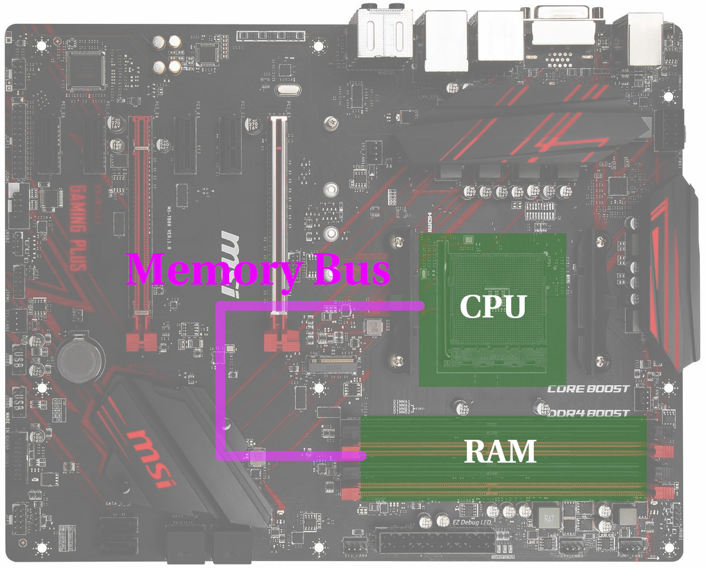

# CPU Caches

<div align="center">
  
</div>

<div class="notes">

</div>

---

# Second Slide

<div align="center" style="overflow: hidden; max-height: 200px;">
  
</div>
<div align="center">
  
</div>

---

# Third 

<div align="center" style="overflow: hidden; max-height: 200px;">
  
</div>
<br><br>
<div align="center">
  
</div>

---

# Fve

```cpp
// Zeilenweise
for (int row = 0; row < dim; row++) {
  for (int col = 0; col < dim; col++) {
    sum += pixel[row][col];
  }
}

```

```cpp
// Spaltenweise
for (int col = 0; col < dim; col++) {
  for (int row = 0; row < dim; row++) {
    sum += pixel[row][col];
  }
}
```

---

# Performance

<div align="center">
  
</div>

---

# Motherboard

<div align="center">
  
</div>

<div class="notes">
  Moore's Law
</div>

---

# Motherboard

<div align="center">
  
</div>

<div class="notes">
  Moore's Law
</div>

---

# CPU vs. RAM Performance

<div align="center">
  
</div>

---

# CPU vs. RAM Performance

<div align="center">
  
</div>

---

# Caching

<div align="center">
  
</div>

<div class="notes">
  Speicher wird als Block geladen; Arbeiten aus Cache schnell
</div>

---

# _

<div align="center" style="overflow: hidden; max-height: 200px;">
  
</div>
<br><br>
<div align="center">
  
</div>

---

# Performance

<div align="center">
  
</div>

---

